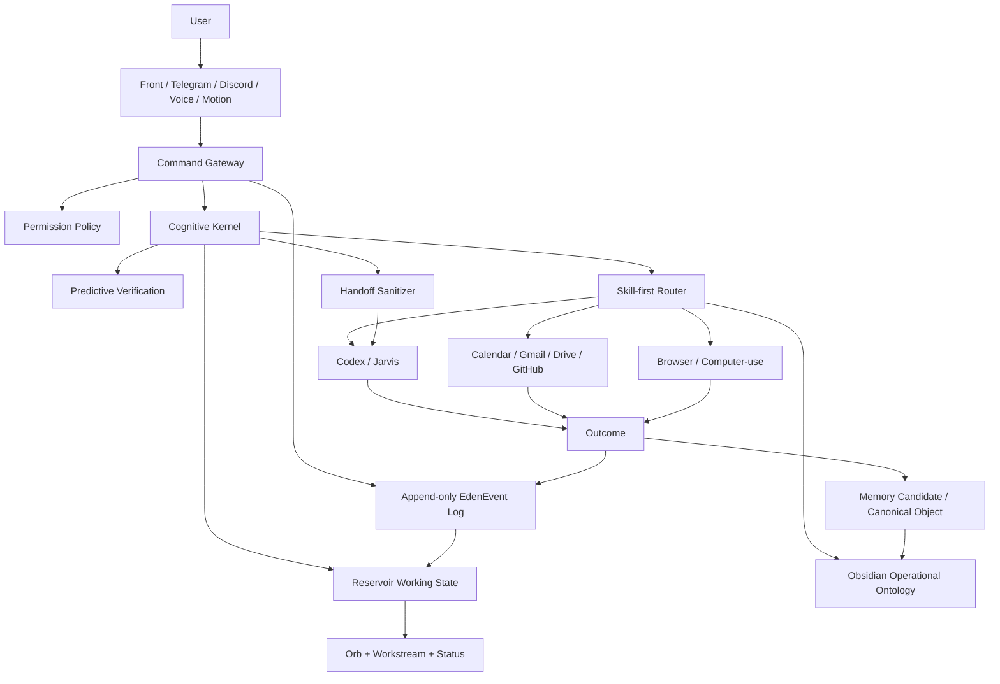

# Eden Agent

Eden Agent is the target blueprint for a personal cognitive operating layer centered on Codex App, Obsidian, and safe tool execution.

It is designed to become more than a chatbot:

- a thinking partner that challenges, verifies, and structures decisions
- a Jarvis-style development executor through Codex
- an operational Obsidian ontology for long-term memory
- a command gateway for front-end, Telegram, Discord, voice, and motion inputs
- a skill-first agent system with permission policy, audit logs, and replayable state

## Core Architecture

## Design Principles

- Do not build one giant autonomous agent.
- Do not treat Codex thread history as durable memory.
- Do not use Obsidian as a raw transcript dump.
- Do not assume the front can directly control an arbitrary Codex thread.
- Do not allow approval-free external automation.
- Build skills and workflows first; use agent loops only when needed.
- Treat Obsidian as a Palantir-inspired operational ontology: objects, links, actions, policies, and outcomes.

## Main Blueprint

The current final design document is:

- [Eden/Jarvis Final Blueprint](docs/blueprints/Eden_Jarvis_Final_Blueprint.md)

The blueprint includes:

- full system map
- Command Gateway design
- EdenEvent and audit model
- Cognitive Kernel
- Reservoir reducer
- Predictive verification loop
- operational Obsidian ontology
- memory lifecycle
- HandoffEnvelope sanitizer
- permission policy matrix
- front HCI and orb state model
- Telegram/Discord/voice/motion channel strategy
- key workflows
- implementation verification harness

## Implementation Dependency Order

This is not an MVP roadmap. It is the dependency order required for the full system to stay coherent.

1. Define shared contracts.
2. Build append-only event and audit store.
3. Build file-event Command Gateway adapter.
4. Build permission policy engine.
5. Build reservoir reducer and replay tests.
6. Connect event stream to front state adapter.
7. Connect `ReservoirState` to `OrbSignal`.
8. Build skill registry and deterministic workflows.
9. Build Obsidian CLI memory search/propose/consolidate.
10. Build operational ontology templates and action types.
11. Build predictive verification over claims and evidence.
12. Build handoff sanitizer and Eden/Jarvis handoff files.
13. Connect Jarvis development workflow through Codex.
14. Add Calendar/Gmail/Drive/GitHub connectors behind permission policy.
15. Add Telegram/Discord command channels.
16. Add voice/motion input encoders.
17. Add scheduled consolidation and review.
18. Add stronger agent loops only where workflows are insufficient.

## Acceptance Criteria

The system is implemented correctly when:

- every command creates an `EdenEvent`
- every risky or external action has a `PermissionDecision`
- the front is driven from event state, not hardcoded mock state
- reservoir state can be replayed from event logs
- Obsidian canonical memory is never raw transcript memory
- Jarvis development handoffs are sanitized
- Codex execution results include validation and residual risks
- Telegram/Discord commands appear in the same audit stream as front commands
- orb state changes are explainable by reservoir signals
- high-risk claims have evidence or are explicitly marked unverified

## Current Status

This repository currently contains the architecture blueprint. It does not yet contain the production implementation.
