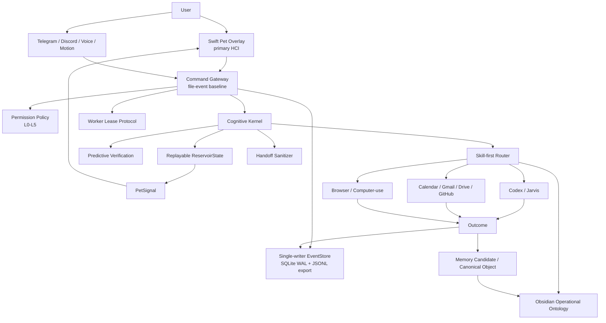

# Eden Agent

Eden Agent is the target blueprint for a personal cognitive operating layer centered on Codex App, Obsidian, Swift-native HCI, and safe tool execution.

It is designed to become more than a chatbot:

- a thinking partner that challenges, verifies, and structures decisions
- a Jarvis-style development executor through Codex
- an operational Obsidian ontology for long-term memory
- a Swift-native always-on-top Pet overlay for constant command/status presence
- a Command Gateway for Pet, Telegram, Discord, voice, and motion inputs
- a skill-first agent system with permission policy, audit logs, and replayable state

## Current Decision

The primary front is no longer a large dashboard-first UI.

```txt
Primary HCI:
  Swift-native always-on-top Pet overlay

Secondary HCI:
  detailed panel/dashboard opened only when useful

Execution host:
  Codex-centered Jarvis workflow

Memory:
  Obsidian operational ontology
```

The Pet is not the AI brain. It is the persistent surface for command, state, approval, and presence.

## Core Architecture



## Design Principles

- Do not build one giant autonomous agent.
- Do not treat Codex thread history as durable memory.
- Do not use Obsidian as a raw transcript dump.
- Do not assume the Pet can directly control an arbitrary Codex thread.
- Do not allow approval-free external automation.
- Build skills and workflows first; use agent loops only when needed.
- Treat Obsidian as a Palantir-inspired operational ontology: objects, links, actions, policies, outcomes, and maintenance commands.
- Treat the Pet as an HCI surface; all action semantics must come from the Gateway/EventStore.

## Main Blueprints

Representative current blueprint:

- [Eden/Jarvis Final Blueprint](docs/blueprints/Eden_Jarvis_Final_Blueprint.md)

Current design set:

- [Swift Native Codex Pet Blueprint](docs/blueprints/current/Swift_Native_Codex_Pet_Blueprint.md)
- [Eden/Jarvis Final Blueprint](docs/blueprints/current/Eden_Jarvis_Final_Blueprint.md)
- [Postfix Review 2026-05-05](docs/blueprints/current/Eden_Jarvis_Postfix_Review_2026-05-05.md)
- [Cognitive Architecture v2](docs/blueprints/current/Eden_Jarvis_Cognitive_Architecture_v2.md)
- [Product Architecture](docs/blueprints/current/Eden_Jarvis_Product_Architecture.md)
- [Motion Bible](docs/blueprints/current/Motion-Bible.md)
- [Lookdev Asset Pipeline](docs/blueprints/current/Lookdev-Asset-Pipeline.md)
- [Motion System](docs/blueprints/current/Motion-System.md)
- [Motion Stack Research](docs/blueprints/current/Motion_Stack_Research.md)
- [Orb State Model](docs/blueprints/current/Orb_State_Model.md)
- [Reference Teardown](docs/blueprints/current/Reference-Teardown.md)
- [UI/UX Brief](docs/blueprints/current/UI-UX-Brief.md)
- [Design System](docs/blueprints/current/Design-System.md)
- [UI Review](docs/blueprints/current/UI-Review.md)
- [UI/UX Vibecoding Pack Upgrade](docs/blueprints/current/UIUX_Vibecoding_Pack_Upgrade.md)
- [Visual QA](docs/blueprints/current/Visual-QA.md)

## Critical Contracts

The latest blueprint closes the main implementation risks with these contracts:

- `CommandEnvelope` is compatible with `CommandGatewayPort.CommandInput`.
- `EventStore` has a single canonical writer: the Gateway.
- SQLite WAL is the canonical store; JSONL is an export/debug format.
- Worker ownership uses leases, heartbeat, stale lease recovery, and idempotency.
- Approval resume is bound to `actionHash`, `scopeSnapshot`, expiry, and a single-use `resumeToken`.
- `ReservoirState -> PetSignal` is deterministic and replayable.
- `WindowPolicy` covers macOS full-screen, Spaces, Stage Manager, multi-display, click-through, shortcut conflict, and emergency hide behavior.
- `ScreenContextPolicy` prevents raw screenshots from becoming durable memory by default.
- Obsidian ontology objects require stable `object_id`, `schemaVersion`, conflict handling, migration, duplicate detection, and backlink repair.

## Implementation Dependency Order

This is not an MVP roadmap. It is the order required for the full system to stay coherent.

1. Define shared contracts.
2. Build single-writer EventStore with transactional sequence, idempotency, leases, and JSONL export.
3. Build file-event Command Gateway adapter with atomic inbox submission.
4. Build worker ownership, lease heartbeat, stale lease recovery, and retry policy.
5. Build permission policy engine.
6. Build approval resume contract and stale approval handling.
7. Build reservoir reducer and replay tests.
8. Connect `ReservoirState -> PetSignal` adapter.
9. Build Swift Pet state adapter and WindowPolicy tests.
10. Build skill registry and deterministic workflows.
11. Build Obsidian CLI memory search/propose/consolidate plus ontology lint/migration/repair.
12. Build operational ontology templates and action types.
13. Build predictive verification over claims and evidence.
14. Build handoff sanitizer and Eden/Jarvis handoff files.
15. Connect Jarvis development workflow through Codex.
16. Add Calendar/Gmail/Drive/GitHub connectors behind permission policy.
17. Add Telegram/Discord command channels.
18. Add voice/motion input encoders and ScreenContextPolicy.
19. Add scheduled consolidation and review.
20. Add stronger agent loops only where workflows are insufficient.

## Acceptance Criteria

The system is implemented correctly when:

- every command creates an `EdenEvent`
- EventStore has exactly one canonical writer
- duplicate idempotency keys return the existing command receipt
- worker leases prevent duplicate command execution
- stale worker leases fail closed for external side effects
- every risky or external action has a `PermissionDecision`
- approval resume is bound to `actionHash`, `scopeSnapshot`, expiry, and a single-use resume token
- the Pet is driven from event state, not hardcoded mock state
- reservoir state can be replayed from event logs
- `PetSignal` is deterministically derived from `ReservoirState`
- Obsidian canonical memory is never raw transcript memory
- Obsidian objects have stable `object_id`, `schemaVersion`, conflict handling, and migration rules
- Jarvis development handoffs are sanitized
- Codex execution results include validation and residual risks
- Telegram/Discord commands appear in the same audit stream as Pet commands
- high-risk claims have evidence or are explicitly marked unverified
- screen context is redacted before event creation and raw screenshots are not durable by default

## Current Status

This repository currently contains the architecture and product blueprints. It does not yet contain the production implementation.

The next engineering phase should start with contracts and verification harnesses, not Pet animation polish.
