# Eden/Jarvis Final Blueprint

Date: 2026-05-05
Status: Final target blueprint after red-team reinforcement
Source baseline: `Eden_Jarvis_Cognitive_Architecture_v2.md`

## 0. Purpose

This blueprint defines the full target architecture for the upgraded Eden/Jarvis system.

The goal is not an MVP split. The goal is a complete design that can be implemented in dependency order without later discovering that the core logic is incoherent.

Target:

```txt
Eden/Jarvis =
  thinking partner
  + development executor
  + operational Obsidian ontology
  + Codex-centered execution host
  + skill-first agent system
  + auditable command gateway
  + HCI state surface
```

## 1. Core Design Decision

The system must not be built as one giant autonomous agent.

It must be built as:

```txt
Front
-> Command Gateway
-> Cognitive Kernel
-> Skill Router
-> Execution Adapters
-> Event/Audit/Memory
```

The front shows one AI presence. Eden, Jarvis, and Hybrid are internal actors.

2026-05-05 HCI decision update:

```txt
Eden Front now means the Swift-native always-on-top Pet overlay first.
The larger dashboard/orb view becomes an optional detailed panel, not the primary surface.
See: Swift_Native_Codex_Pet_Blueprint.md
```

## 2. Whole System Map

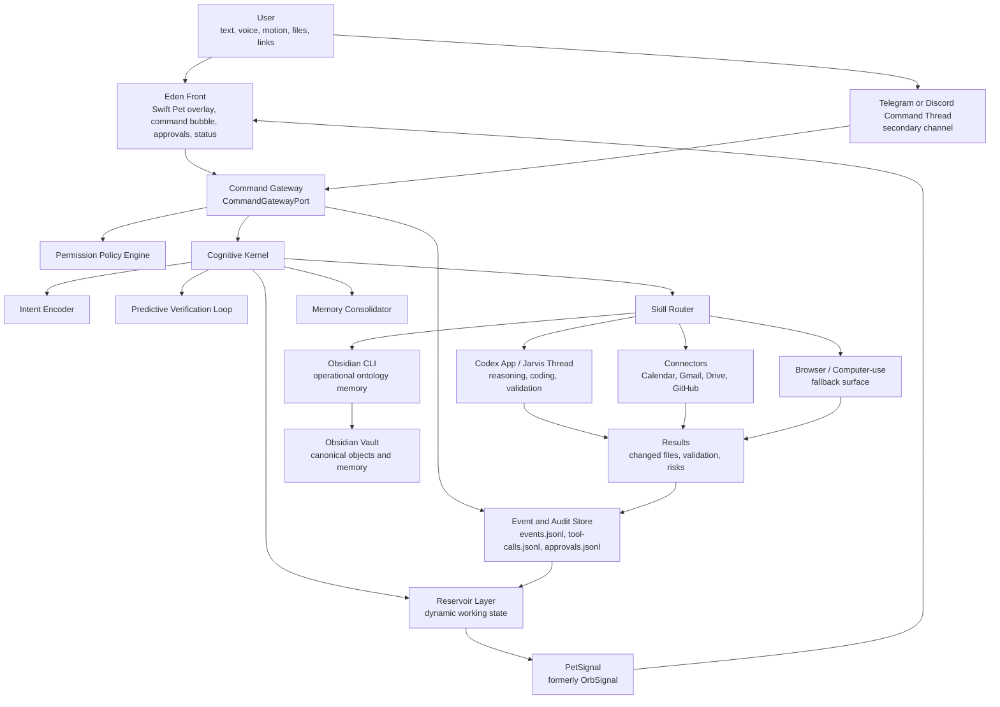

## 3. Layer Responsibilities

| Layer | Responsibility | Must Not Do |
| --- | --- | --- |
| Eden Front | Swift Pet overlay, input, live status, approvals, compact work state | Directly assume Codex thread control |
| Mobile Channel | Quick command, remote approval, brief delivery | Replace the primary HCI surface |
| Command Gateway | Normalize commands, route, apply policy, write audit | Make unsourced reasoning decisions |
| Cognitive Kernel | Maintain state, route skills, verify claims, propose memory | Bypass permissions |
| Skills | Stable procedural units | Become hidden one-off prompts |
| Codex App | Deep reasoning, coding, tests, reviews | Store durable personal memory |
| Obsidian CLI | Durable operational ontology | Store raw everything or secrets |
| Connectors | Structured external access | Send/change external state without policy |
| Browser/Computer-use | GUI fallback | Replace structured APIs when APIs exist |

## 4. Command Gateway Blueprint

The front and mobile channels talk only to `CommandGatewayPort`.

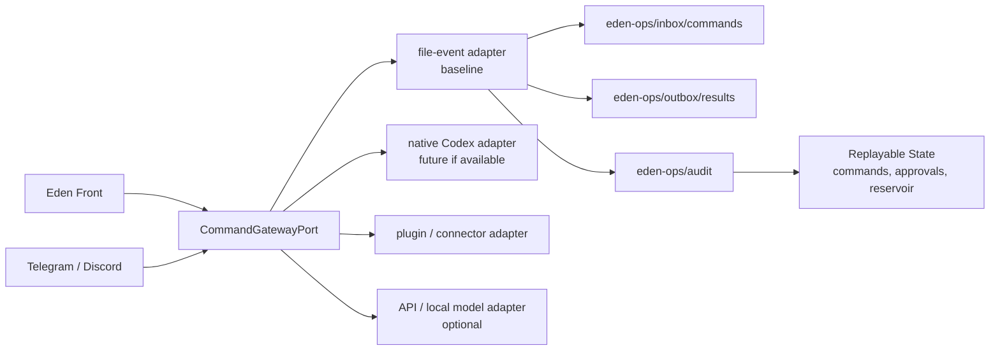

Baseline rule:

- `file-event` is the first implementation adapter.
- Native Codex control is an optimization, not an assumption.
- The front never imports adapter-specific APIs.
- Every adapter emits the same `EdenEvent` schema.

### Worker Ownership And Lease Protocol

The file-event adapter must define worker ownership before any real execution.

Command state machine:

```txt
received
-> queued
-> claimed
-> running
-> waiting-approval
-> running
-> succeeded / failed / cancelled / blocked
```

Rules:

- Front/Pet writes command request files only.
- Gateway validates request files and moves accepted commands into the canonical EventStore.
- Gateway is the only process that assigns command status and event sequence.
- Workers claim commands through Gateway or a Gateway-owned lease transaction.
- A lease contains `commandId`, `workerId`, `actionHash`, `scopeSnapshot`, `claimedAt`, `heartbeatAt`, and `expiresAt`.
- Late worker results are rejected if the lease expired or action hash changed.
- Stale leases emit `worker.lease_expired` and are retried only for actions without external side effects.
- Duplicate `idempotencyKey` returns the existing command receipt.
- Commands are written through `.tmp` files followed by atomic rename; partial files are ignored.

### Command Flow

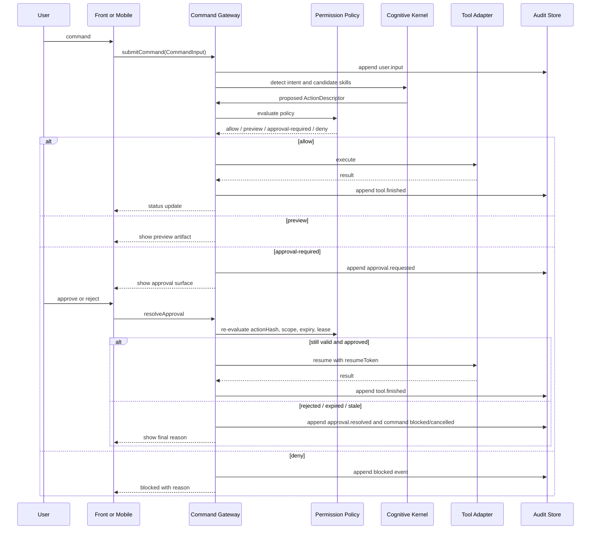

## 5. Core Data Contracts

### EdenEvent

`EdenEvent` is the replayable truth stream.

Required fields:

```txt
id
schemaVersion
createdAt
recordedAt
sequence
correlationId
sessionId
commandId
parentEventId
idempotencyKey
status
source
type
actor
actorInstance
trust
sensitivity
scope
summary
payloadRef
relatedIds
hash
```

Invariants:

- Event log is append-only.
- Corrections are new events.
- `sequence` is monotonically increasing.
- `idempotencyKey` prevents duplicate execution.
- `correlationId` groups one user-level request.
- Replaying events reconstructs command status, approval status, and reservoir state.

### EventStore Atomicity

The Gateway is the only canonical EventStore writer.

Equivalently: the Gateway is the single canonical EventStore writer for sequence, hash, status, approval, and lease mutations.

Baseline:

```txt
canonical event store:
  eden-ops/audit/event-store.sqlite

debug/export mirrors:
  eden-ops/audit/events.jsonl
  eden-ops/audit/tool-calls.jsonl
  eden-ops/audit/approvals.jsonl
```

Rules:

- Pet, workers, connectors, and Codex adapters never append canonical events directly.
- Gateway assigns `sequence` inside one transaction.
- Gateway calculates `hash` from canonical JSON excluding `hash`.
- Gateway enforces unique `idempotencyKey` per relevant command/action scope.
- JSONL files are generated by Gateway as exports or mirrors.
- If JSONL export fails, canonical SQLite state remains authoritative.
- If a worker crashes after a side effect, recovery emits a reconciliation event instead of deleting history.
- Event replay starts from the canonical EventStore, not from partial outbox files.

Minimum SQLite tables:

```txt
events(sequence, id, schemaVersion, createdAt, recordedAt, correlationId, sessionId,
       commandId, parentEventId, idempotencyKey, status, source, type, actor,
       actorInstance, trust, sensitivity, scopeJson, summary, payloadRef,
       relatedIdsJson, hash)

commands(commandId, idempotencyKey, sessionId, status, actorHint, intentHint,
         requestedScopeJson, userPresence, createdAt, updatedAt)

approvals(approvalId, commandId, actionHash, resumeTokenHash, scopeSnapshotJson,
          status, requestedAt, expiresAt, resolvedAt)

leases(commandId, workerId, actionHash, scopeSnapshotJson, claimedAt,
       heartbeatAt, expiresAt, status)
```

## 6. Cognitive Kernel Blueprint

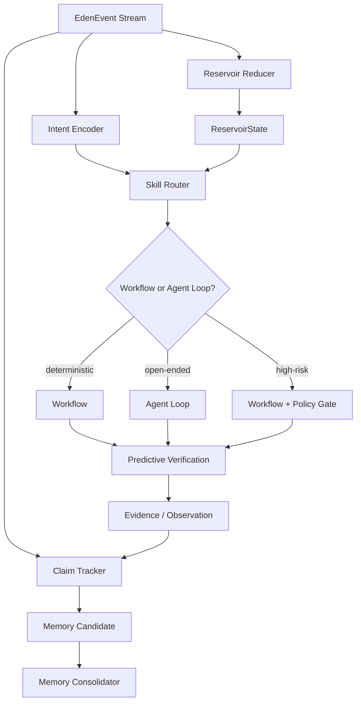

Kernel rule:

```txt
The kernel chooses the next action.
The policy engine decides whether it may execute.
The event log records what happened.
The reservoir describes what state the system is in.
```

## 7. Intent And Actor Routing

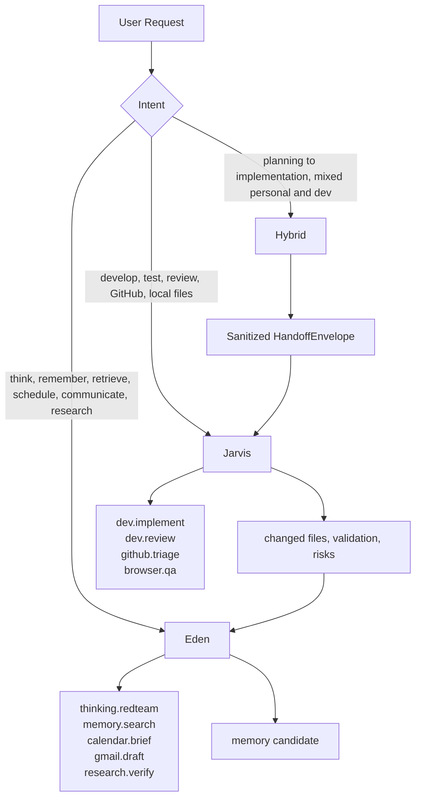

Routing rules:

- Deterministic repeated work becomes workflow.
- Open-ended work with tool feedback becomes agent loop.
- High-risk work becomes gated workflow even if an agent helps.
- User-facing mode switching is avoided.

## 8. Reservoir Layer Blueprint

Reservoir is dynamic working state, not long-term memory.

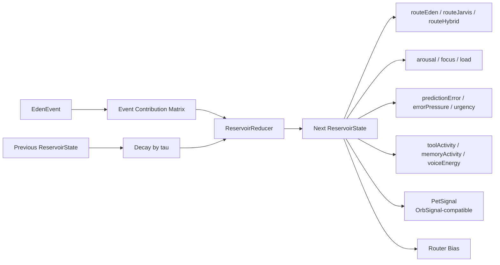

Signals:

```txt
routeEden
routeJarvis
routeHybrid
arousal
focus
load
confidence
urgency
voiceEnergy
toolActivity
memoryActivity
predictionError
userDecisionPressure
errorPressure
```

Reducer rule:

```txt
state[k] = clamp01(state[k] * decay(dt, tau[k]) + contribution[event.type][k])
```

Required tests:

- Same event log produces same state.
- Duplicate `idempotencyKey` does not double-count execution.
- Failed tool followed by successful retry reduces error pressure gradually.
- Approval request increases `userDecisionPressure`.
- Approval resolution decreases `urgency` and `userDecisionPressure`.

### ReservoirState To PetSignal

`PetSignal` is a runtime projection. It must be derived, replayable, and disposable.

Required `PetSignal` fields:

```txt
route
routeScores
activity
attention
urgency
confidence
toolActivity
memoryActivity
voiceEnergy
predictionError
decisionPressure
approvalPressure
errorPressure
progress
sourceEventId
derivedAt
ttlSeconds
```

Mapping rules:

- `routeScores` preserve Eden/Jarvis/Hybrid affinity even when the visual Pet shows one dominant route.
- `route` is the dominant score unless scores are close; close mixed context maps to `hybrid`.
- `activity` is chosen by priority: `blocked`, `approval`, `working`, `responding`, `listening`, `thinking`, `done`, `idle`.
- `working` requires a real `claimed` or `running` command.
- `approval` requires a pending approval event.
- stale `PetSignal` falls back to idle and shows a stale-status hint.
- animation smoothing is allowed only after this deterministic mapping.

## 9. Predictive Verification Blueprint

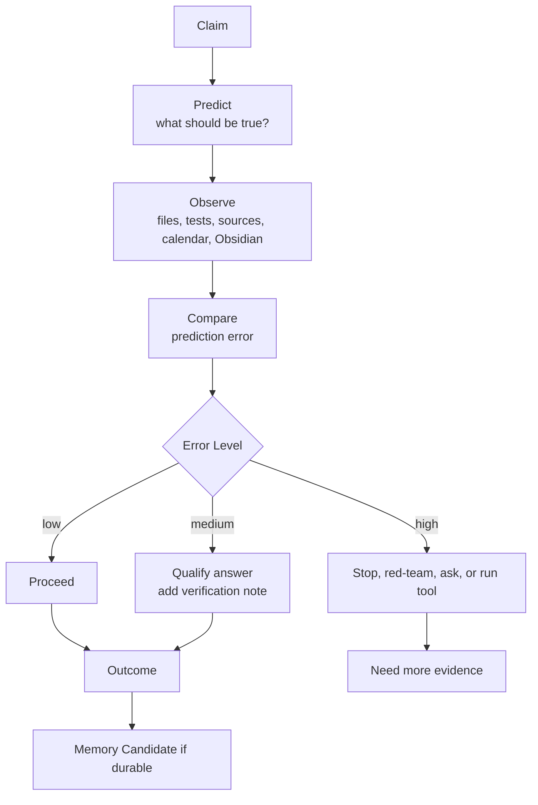

Claim statuses:

```txt
observed
inferred
assumed
unverified
stale
refuted
```

This is the main anti-hallucination loop.

## 10. Operational Obsidian Ontology

Obsidian should become a personal Foundry-lite, not a raw note dump.

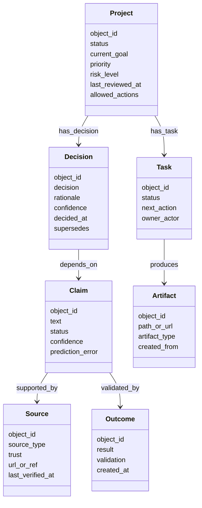

Core object types:

```txt
Project
Decision
Claim
Task
Source
Artifact
Tool
Constraint
Preference
Outcome
OpenLoop
Session
```

Core action types:

```txt
project.update_status
project.create_task
task.create_next
claim.verify
decision.review
memory.promote
memory.deprecate
jarvis.handoff
artifact.summarize
source.verify
```

Ontology rule:

```txt
Important notes become objects.
Objects have properties, links, allowed actions, and audit traces.
Not every note must become an object.
```

## 11. Memory Lifecycle

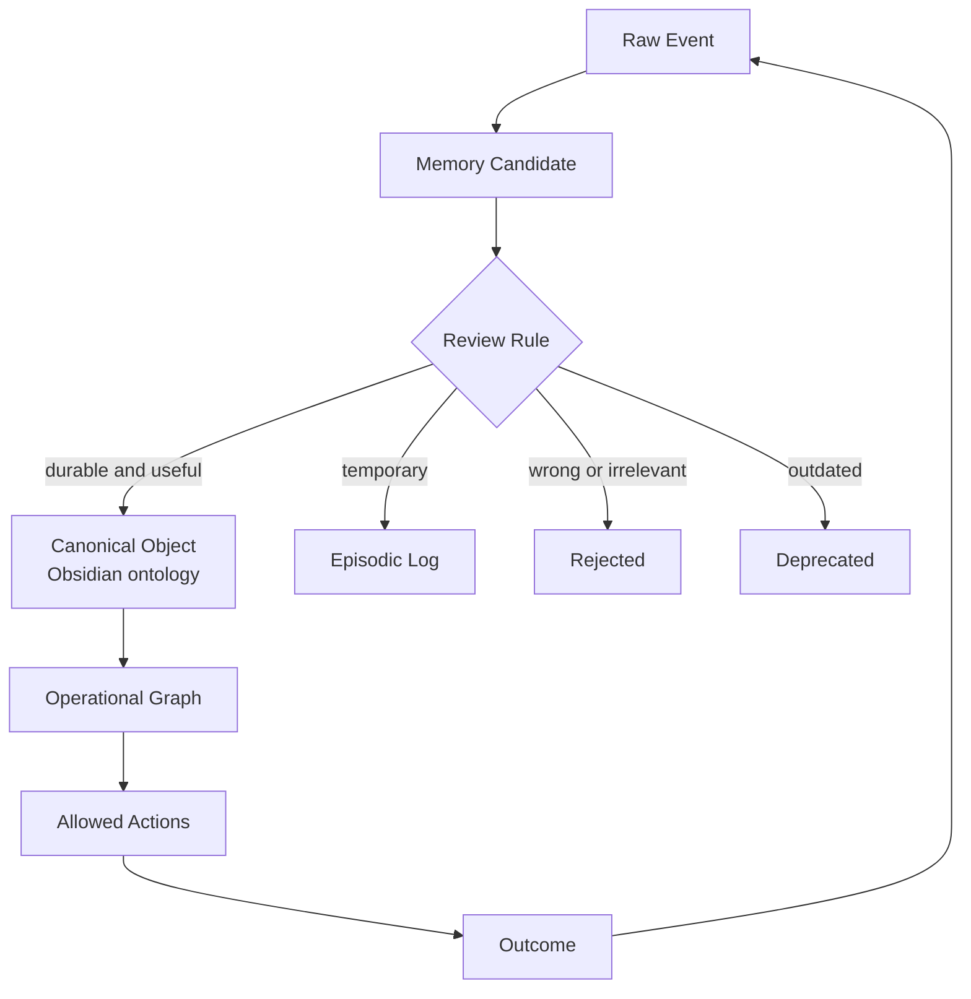

Promote only when:

- The user states a durable preference or constraint.
- A decision is made.
- A project state changes.
- A repeated pattern becomes operationally useful.
- A source is verified and relevant.
- A failure reveals a durable rule.

Never promote:

- Secrets.
- Raw Gmail.
- Raw Calendar.
- Raw personal transcript.
- One-off implementation noise.
- Unverified external claims.

### Obsidian Ontology Operations

The vault needs operational rules, not only object types.

Object identity:

```txt
object_id:
  globally unique
  never derived only from filename
  stored in frontmatter
  stable across rename/move

schemaVersion:
  required on every operational object
  migrated by explicit migration scripts
```

Conflict and sync rules:

- Duplicate `object_id` becomes a conflict object under `60_Memory/Conflicts/`.
- Obsidian Sync/iCloud conflict copies are never promoted automatically.
- File rename does not change `object_id`; backlink repair is a maintenance action.
- Canonical merge requires a merge note that records source object ids and rationale.
- Deprecated objects keep redirects/backlinks instead of being deleted.
- Link rot creates a `claim.verify` or `source.verify` task, not silent removal.
- Schema migrations are dry-run first and write a migration report.
- Memory promotion checks for existing object by `object_id`, alias, source hash, and semantic duplicate.

Required maintenance commands:

```txt
ontology.lint
ontology.migrate --dry-run
ontology.repair_links
ontology.find_duplicates
memory.merge_candidates
memory.deprecate
```

## 12. Handoff Sanitization Blueprint

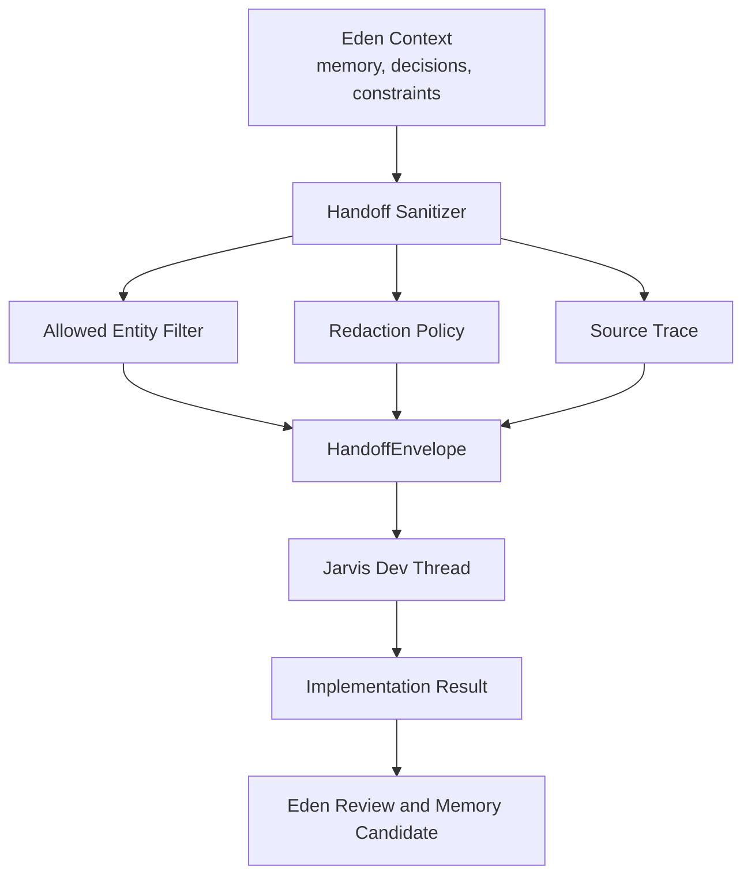

Handoff rules:

- Raw memory is never handed to Jarvis.
- Handoff is summary-only by default.
- Person, RawEmail, RawCalendar, Credential, Secret are forbidden unless explicitly approved.
- Handoff files live outside development repos unless intentionally copied as sanitized artifacts.

## 13. Permission Policy Blueprint

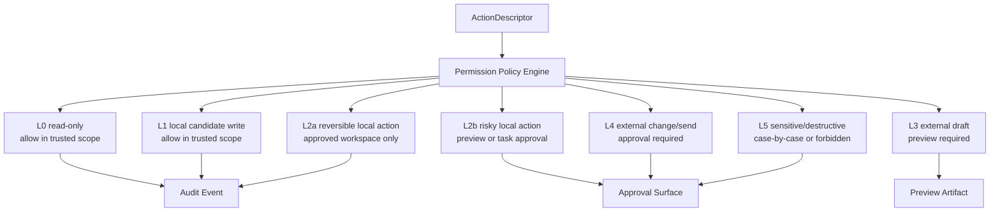

Policy input:

```txt
actionType
scope
sensitivity
reversibility
destination
userPresence
taskApproved
allowlistHit
```

No adapter may execute until `PermissionDecision` exists.

### Approval Resume Contract

Approval is authorization for one exact action, not a broad conversational permission.

Required approval fields:

```txt
approvalId
commandId
actionHash
resumeTokenHash
previewRef
scopeSnapshot
requestedAt
expiresAt
status
resolvedAt
decision
decisionNote
```

Resume rules:

- `actionHash` is calculated from canonical `ActionDescriptor` plus destination and scope.
- `scopeSnapshot` freezes workspace, vault, connector, repo, and destination context at request time.
- `resumeToken` is stored hashed and is single-use.
- Approval expires by default; external sends and destructive actions use short expiry.
- Gateway re-runs policy after approval resolution.
- If scope, action hash, lease, preview artifact, or destination changed, approval becomes `stale`.
- `approve` may resume execution only through Gateway.
- `reject`, `expired`, and `stale` must emit events and leave the command in a terminal or waiting state with a user-visible reason.

## 14. Front HCI Blueprint

Primary HCI surface:

```txt
Swift-native always-on-top Pet overlay
```

The earlier web dashboard composition is now a secondary detailed panel. The Pet is the default surface because the intended product behavior is constant presence, quick command, quick approval, and low context switching.

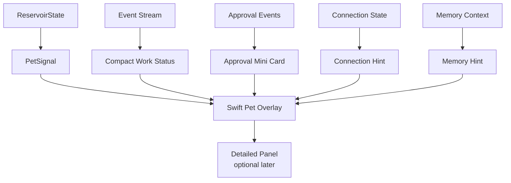

Pet zones:

```txt
Pet body: presence, route, state, drag target
speech bubble: compact command input and short response
approval card: approve, reject, inspect
menu bar: settings, permissions, logs
detailed panel: optional dashboard for long logs and diagnostics
```

Pet mapping:

```txt
routeEden / routeJarvis / routeHybrid -> color family
activity -> motion family
predictionError -> rim instability
toolActivity -> cilia / external field
memoryActivity -> lattice density
voiceEnergy -> speech pulse
urgency -> tension / brightness
confidence -> stability
```

Rules:

- Pet state must be driven by event/reducer state, not hardcoded fake progress.
- The Pet must not own durable memory.
- The Pet must not bypass Command Gateway policy.
- Full dashboard surfaces are opened on demand, not shown by default.

## 15. Channel Strategy

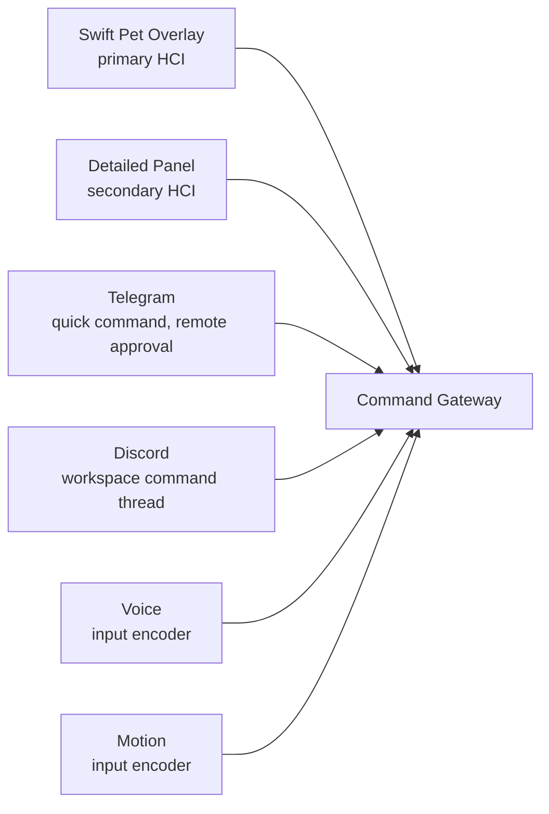

Rules:

- Swift Pet Overlay is the primary visual control surface.
- The detailed dashboard/panel is secondary and opened only when useful.
- Telegram/Discord are secondary command channels.
- Voice and motion are input encoders, not the control-plane foundation.
- Every channel must emit `EdenEvent`.

## 16. Key Workflows

### Development Request

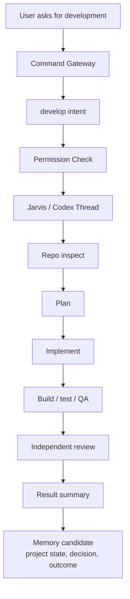

### Thinking Request

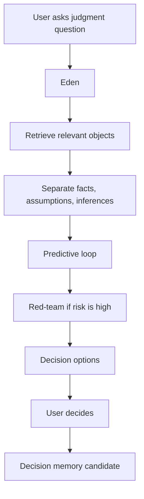

### Daily Brief

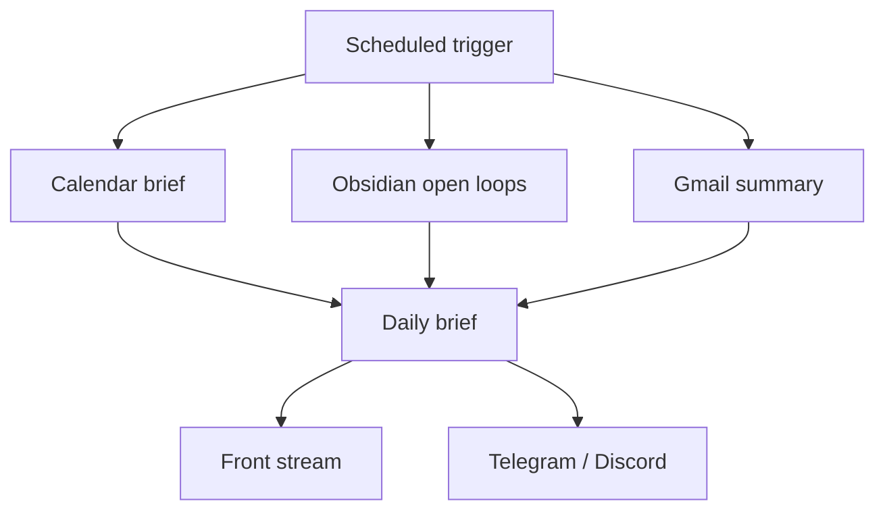

### Memory Consolidation

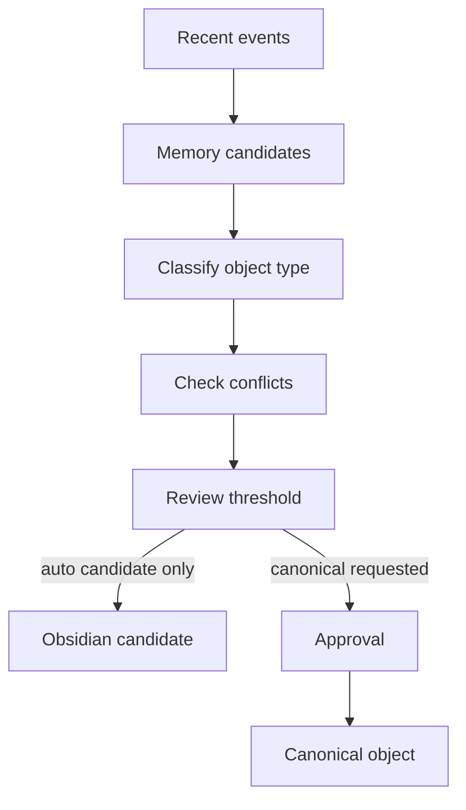

## 17. Storage Blueprint

```txt
eden-ops/
  inbox/
    commands/
  outbox/
    results/
  audit/
    event-store.sqlite
    events.jsonl
    tool-calls.jsonl
    approvals.jsonl
  runtime/
    state/
    leases/
    locks/
    cache/
  ontology/
    object-types.yaml
    link-types.yaml
    action-types.yaml
    permission-policy.yaml
  handoffs/
    eden-to-jarvis/
    jarvis-to-eden/

Obsidian Vault/
  00_System/
    Ontology/
      ObjectTypes/
      LinkTypes/
      ActionTypes/
      Views/
      Policies/
      Functions/
  01_Inbox/
  20_Projects/
  50_Decisions/
  60_Memory/
    Candidate/
    Canonical/
    Deprecated/
    Conflicts/
  70_Sources/
  80_Reviews/
```

## 18. Would This Work As Intended?

| Intended Behavior | Blueprint Support | Verdict |
| --- | --- | --- |
| User talks to one AI presence | Front + internal routing | Works if mode labels remain internal |
| Front can command work safely | CommandGatewayPort + permission policy | Works if file-event adapter is implemented first |
| Codex can execute dev work | Jarvis thread + handoff + dev skills | Works if Codex control bridge exists or file-event worker is used |
| Obsidian acts as long-term memory | Operational ontology + memory lifecycle | Works if promotion is strict |
| AI avoids hallucinated certainty | Predictive loop + Claim statuses | Works if high-risk claims require evidence |
| Pet reflects real state | Event log -> reservoir -> PetSignal | Works if reducer is replayable |
| Telegram/Discord control is possible | Secondary channel -> Gateway | Works as command channel, not full UI replacement |
| Automation can be broad but safe | L0-L5 policy matrix | Works if L4/L5 gates are enforced |
| Personal memory does not leak into dev | HandoffEnvelope sanitizer | Works if raw memory is never handed off |

Overall verdict:

```txt
The architecture is coherent.
It will work as intended only if the Command Gateway, permission engine,
handoff sanitizer, and reservoir reducer are implemented before broad integrations.
```

## 19. Red Team Review

### Finding A: Gateway Ambiguity

Risk:

```txt
If Codex thread control is assumed too early, the front becomes a fake cockpit.
```

Fix:

```txt
Use file-event adapter as the baseline.
Treat native Codex control as replaceable adapter.
```

Status: reinforced in final blueprint.

### Finding B: Permission Creep

Risk:

```txt
L0-L2 unattended work can accidentally include risky writes.
```

Fix:

```txt
Split L2 into L2a and L2b.
Evaluate actionType, scope, sensitivity, reversibility, destination, userPresence.
```

Status: reinforced in final blueprint.

### Finding C: Memory Leakage

Risk:

```txt
Eden can leak personal memory into Jarvis development logs.
```

Fix:

```txt
Require HandoffEnvelope and sanitizer report.
Forbid raw email, raw calendar, credentials, secrets, and full transcripts.
```

Status: reinforced in final blueprint.

### Finding D: Reservoir Becomes Decorative

Risk:

```txt
Reservoir state can become arbitrary UI scores.
```

Fix:

```txt
Use event contribution matrix, decay constants, clamp, replay tests.
```

Status: reinforced in final blueprint.

### Finding E: Obsidian Becomes Overmodeled

Risk:

```txt
Palantir-inspired ontology can turn the vault into schema busywork.
```

Fix:

```txt
Only important notes become operational objects.
Use Project, Decision, Claim, Task, Source, Artifact, Tool, Constraint, Preference, Outcome first.
```

Status: reinforced in final blueprint.

### Finding F: Predictive Loop Slows Everything

Risk:

```txt
Every casual answer becomes too heavy.
```

Fix:

```txt
Use verification tiers:
trivial -> answer directly
normal -> claim/evidence discipline
high-risk -> predictive loop + red-team + tool verification
```

Status: final implementation requirement.

## 20. Final Reinforced Architecture

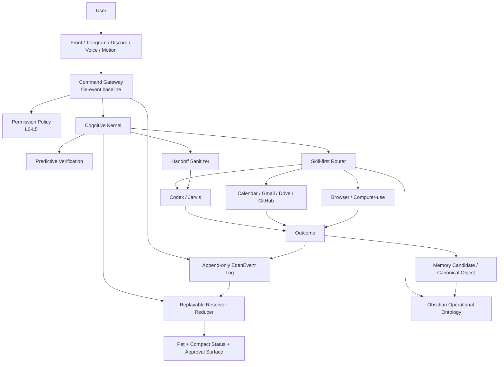

## 21. Implementation Dependency Order

This is not an MVP roadmap. It is the dependency order required for the full system to stay coherent.

1. Define shared contracts:
   `CommandGatewayPort`, `CommandEnvelope`, `EdenEvent`, `ExecutionScope`, `ActionDescriptor`, `PermissionDecision`, `ApprovalRequest`, `ApprovalResume`, `WorkerLease`, `SkillDefinition`, `Claim`, `MemoryCandidate`, `ReservoirState`, `PetSignal`, `HandoffEnvelope`.
2. Build single-writer EventStore with transactional sequence, idempotency, leases, and JSONL export.
3. Build file-event Command Gateway adapter with atomic inbox submission.
4. Build worker ownership, lease heartbeat, stale lease recovery, and retry policy.
5. Build permission policy engine.
6. Build approval resume contract and stale approval handling.
7. Build reservoir reducer and replay tests.
8. Connect `ReservoirState -> PetSignal` adapter.
9. Build Swift Pet state adapter and WindowPolicy tests.
10. Build skill registry and deterministic workflows.
11. Build Obsidian CLI memory search/propose/consolidate plus ontology lint/migration/repair.
12. Build operational ontology templates and action types.
13. Build predictive verification over claims and evidence.
14. Build handoff sanitizer and Eden/Jarvis handoff files.
15. Connect Jarvis development workflow through Codex.
16. Add Calendar/Gmail/Drive/GitHub connectors behind permission policy.
17. Add Telegram/Discord command channels.
18. Add voice/motion input encoders and ScreenContextPolicy.
19. Add scheduled consolidation and review.
20. Add stronger agent loops only where workflows are insufficient.

## 22. Acceptance Criteria

The design is implemented correctly when:

- Every command creates an `EdenEvent`.
- EventStore has exactly one canonical writer.
- Duplicate idempotency keys return the existing command receipt.
- Worker leases prevent duplicate command execution.
- Stale worker leases fail closed for external side effects.
- Every external or risky action has a `PermissionDecision`.
- Approval resume is bound to `actionHash`, `scopeSnapshot`, expiry, and single-use resume token.
- The front can be driven from event state, not hardcoded mock state.
- Reservoir state can be replayed from event logs.
- `PetSignal` is deterministically derived from `ReservoirState`.
- Obsidian canonical memory is never raw transcript memory.
- Obsidian objects have stable `object_id`, `schemaVersion`, conflict handling, and migration rules.
- Jarvis development handoffs are sanitized.
- Codex execution results include validation and residual risks.
- Telegram/Discord commands appear in the same audit stream as front commands.
- Pet state changes are explainable by reservoir signals.
- High-risk claims have evidence or are explicitly marked unverified.
- Screen context is redacted before event creation and raw screenshots are not durable by default.

## 23. Implementation Verification Harness

The system should not be considered implemented just because the front renders and tools run.

It needs a verification harness that proves the control-plane logic works.

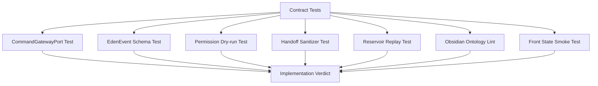

Required verification:

| Test | Pass Condition |
| --- | --- |
| Command gateway contract | same command can run through file-event adapter without front changes |
| Event schema | every command/tool/approval/result emits valid `EdenEvent` |
| EventStore atomicity | concurrent writes cannot create duplicate sequence numbers or corrupt events |
| Idempotency | duplicate command does not execute twice |
| Worker lease | two workers cannot claim the same command; stale leases are recovered safely |
| Permission dry-run | L4/L5 actions never execute without approval |
| Approval resume | stale action hash, expired approval, or changed scope cannot execute |
| Handoff sanitizer | forbidden raw personal data is removed before Jarvis receives handoff |
| Reservoir replay | same event log always produces same `ReservoirState` |
| PetSignal adapter | same reservoir state creates same Pet signal and stale signals fall back to idle |
| Pet state | visible Pet state can be traced to reservoir signals |
| Obsidian lint | object notes satisfy required frontmatter and link/action constraints |
| Obsidian migration | duplicate ids, conflict copies, and schema migrations are detected before write |
| Memory promotion | canonical memory cannot be written without candidate/review path |
| Connector safety | Gmail send, calendar update, GitHub push require approval event |
| Screen context safety | raw screenshots are redacted or discarded before durable events |

Failure recovery:

- Failed commands emit `error.raised` and `tool.finished:failed`.
- Failed commands keep their audit trail.
- Retried commands use a new command id but link to the original `correlationId`.
- Partial local writes must be summarized in the result.
- External side effects must never be retried silently.

## 24. Residual Risks

| Risk | Current Mitigation | Remaining Gap |
| --- | --- | --- |
| No stable native Codex thread API | file-event adapter | Requires a worker/thread convention |
| Obsidian ontology overhead | only important notes become objects | Needs templates and linting |
| Permission errors | policy engine and audit | Needs tests and dry-run mode |
| Prompt injection from external sources | trust/sensitivity/source labels | Needs untrusted-source handling in skills |
| Browser/computer-use fragility | fallback only | Needs structured APIs where possible |
| Voice/motion ambiguity | input encoder only | Needs confirmation for high-risk commands |

## 25. Final Verdict

The blueprint is suitable for the user's target:

```txt
thinking
+ work
+ execution
+ long-term memory
+ personal operating layer
```

It is not suitable if implemented as:

- one giant agent,
- a decorative Pet/front-end,
- raw transcript memory,
- approval-free external automation,
- direct Codex control without the gateway.

Final architecture:

```txt
Eden/Jarvis Final =
  Operational Obsidian Ontology
  + Command Gateway
  + Skill-first Agent System
  + Predictive Verification
  + Reservoir Working State
  + Codex Execution
  + Policy/Audit
  + Swift Pet HCI
```

## 26. References

- `Eden_Jarvis_Cognitive_Architecture_v2.md`
- `Eden_Jarvis_Product_Architecture.md`
- `Swift_Native_Codex_Pet_Blueprint.md`
- `Motion-Bible.md`
- `Orb_State_Model.md`
- Artem Kirsanov: Reservoir Computing, Predictive Coding, Modular Architecture, Cognitive Maps, Memory Selection
- Anthropic: Building Effective Agents, Skills over Agents
- OpenClaw: Gateway, Skills, Showcase, Security
- Palantir Foundry Ontology: objects, links, actions, operational ontology
