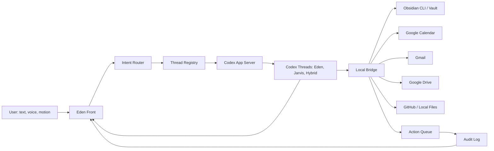

# Eden/Jarvis Product Architecture

Date: 2026-05-03
Status: Initial product/front planning baseline

Supersession note:

- Use `Eden_Jarvis_Cognitive_Architecture_v2.md` as the full target architecture.
- This document remains useful for the initial front/product framing and early UI scope.
- If this document conflicts with v2, v2 wins.

## 1. Core Intent

Eden/Jarvis is not a simple chatbot. It is a personal operating surface that combines thinking support, long-term context, local development execution, schedule/context retrieval, and controlled automation.

The system should act as:

- a thinking partner that challenges, verifies, structures, and implements ideas
- a long-term memory harness using Obsidian as the durable knowledge base
- a Codex App-centered execution system for development and local work
- a front-end command surface for conversation, work streams, approvals, and status visibility
- a future voice/motion command interface without making those inputs the core architecture

## 2. Non-Goals

- Do not build a movie-style Jarvis UI first.
- Do not merge personal memory, calendar, email, and development harness files into one unsafe repo.
- Do not treat Codex thread history as permanent memory.
- Do not allow every external action to run without review from day one.
- Do not make MCP the only path for critical memory operations if the connection is unreliable.
- Do not force all reasoning through a fixed "genius persona" model.

## 3. System Roles

| Layer | Role | Notes |
| --- | --- | --- |
| Eden Front | Human interaction surface | Shows state, conversation, stream, logs, approvals, and connected context. |
| Codex App | Primary AI work host | Handles deep reasoning, implementation, file work, and tool/plugin execution. |
| Codex App Server | Thread control bridge | Lets the front start/resume/fork/send turns to Codex threads where available. |
| Eden Ops Harness | Registry, permissions, action queue, audit | Keeps the system controlled and inspectable. |
| Obsidian Vault | Long-term memory | Stores durable, reviewed, sourced personal context. |
| Obsidian CLI | Stable memory kernel | Preferred core path for read/write/search over unstable MCP-only memory access. |
| Google Calendar | Time truth | Schedule, commitments, time windows, reminders. |
| Google Drive | Artifact/source context | Docs, notes, working files, source links. |
| Gmail | Communication context | Email triage, draft generation, follow-up extraction. |
| GitHub/local files | Development surface | Code, issues, PRs, local repo state. |
| Local model | Low-cost input/router layer | Useful for voice cleanup, command normalization, intent routing, short UI summaries. |

## 4. Key Architecture Decision

The front should not expose hard Eden/Jarvis mode switching to the user.

Instead:

- the user talks to one surface
- the system internally routes each request
- the Overlay Pet keeps one external appearance and expresses activity through motion, posture, glow, and urgency
- the right status panel shows context, permissions, connections, and blockers
- Eden/Jarvis/Hybrid remain backend actor concepts, not primary UI labels

Internal actors:

- Eden: thinking, daily context, memory, decisions, calendar, communication context
- Jarvis: development, local files, GitHub, Codex execution, test loops
- Hybrid: Eden plans and validates; Jarvis implements; Eden records outcome

UI rule:

- Do not render "Eden", "Jarvis", or "Hybrid" as selectable modes or prominent center-panel labels.
- Do not create separate Eden/Jarvis/Hybrid Pet bodies, skins, route colors, costumes, or badges.
- The system may store the routed actor internally for registry, audit, permissions, and debugging.
- The user-facing surface should feel like one continuous AI presence.

## 5. High-Level Flow



## 6. Memory Model

Obsidian is the long-term memory. Codex threads are working sessions.

Memory states:

- raw: unprocessed capture
- inbox: waiting for classification
- candidate: proposed memory, not yet canonical
- active: currently useful working memory
- canonical: reviewed long-term memory
- deprecated: outdated but historically relevant
- rejected: not accepted as memory
- archived: retained but inactive

Required metadata:

- id
- type
- status
- source
- source_level
- confidence
- created_at
- last_verified_at
- review_after or expires_at
- related
- sensitivity
- human_reviewed

Core ontology types:

- Person
- Project
- Area
- Goal
- Interest
- Skill
- Tool
- Decision
- Preference
- Constraint
- Task
- OpenLoop
- Source
- Artifact
- Event
- Experiment
- Outcome
- Session

Core relation types:

- belongs_to
- supports
- conflicts_with
- depends_on
- blocked_by
- created_from
- validated_by
- invalidated_by
- supersedes
- related_to
- decided_in
- used_for

## 7. Vault Structure

```txt
Eden Vault/
├─ 00_System/
│  ├─ Eden_Principles.md
│  ├─ AI_Rules.md
│  ├─ Ontology.md
│  ├─ Permission_Model.md
│  └─ Thread_Registry_Index.md
├─ 01_Inbox/
│  ├─ Captures/
│  ├─ Raw/
│  └─ To_Process/
├─ 10_Daily/
├─ 20_Projects/
├─ 30_Areas/
├─ 40_People/
├─ 50_Decisions/
├─ 60_Memory/
│  ├─ Candidate/
│  ├─ Canonical/
│  ├─ Deprecated/
│  └─ Conflicts/
├─ 70_Sources/
│  ├─ Gmail/
│  ├─ Calendar/
│  ├─ Drive/
│  ├─ Web/
│  └─ GitHub/
├─ 80_Reviews/
└─ 90_Archive/
```

## 8. Eden Ops Harness Structure

This is separate from the development harness.

```txt
eden-ops/
├─ AGENTS.md
├─ eden.config.yaml
├─ ontology/
│  ├─ schema.yaml
│  ├─ entity-types.yaml
│  ├─ relation-types.yaml
│  └─ permission-levels.yaml
├─ threads/
│  ├─ registry.yaml
│  ├─ eden-command.yaml
│  ├─ jarvis-dev.yaml
│  ├─ hybrid.yaml
│  └─ archived/
├─ handoffs/
│  ├─ eden-to-jarvis/
│  ├─ jarvis-to-eden/
│  └─ completed/
├─ actions/
│  ├─ pending/
│  ├─ approved/
│  ├─ executed/
│  └─ rejected/
├─ memory/
│  ├─ candidate/
│  ├─ canonical-index.yaml
│  ├─ conflicts.yaml
│  └─ review-queue.yaml
├─ audit/
│  ├─ events.jsonl
│  ├─ tool-calls.jsonl
│  └─ approvals.jsonl
└─ runtime/
   ├─ locks/
   ├─ cache/
   └─ snapshots/
```

## 9. Development Harness Boundary

The installed current harness is a development harness only.

Rules:

- Dev Harness manages code, tests, review, implementation quality, and release safety.
- Eden Ops Harness manages personal memory, daily operations, approvals, and context routing.
- Dev Harness must not directly read the full Obsidian vault, Gmail, or Calendar.
- Eden may pass a sanitized implementation brief to Jarvis.
- Jarvis returns implementation summary, changed files, tests, risks, and unresolved decisions.
- No raw personal data should be stored in development repos.

## 10. Thinking Engine

The thinking partner should not only ask questions. It should externalize and verify reasoning.

Recommended loop:

1. Define the question.
2. Retrieve relevant context from Obsidian, calendar, files, or sources.
3. Separate facts, assumptions, inferences, opinions, and decisions.
4. Identify missing evidence.
5. Run critique or red-team reasoning when risk is high.
6. Prototype, calculate, inspect, or implement when the question can be tested.
7. Compare the result against the original claim.
8. Store only reviewed conclusions as candidate or canonical memory.

The "Gems" thinking lenses are optional tools, not a universal truth engine:

- first principles
- regret minimization
- inversion
- imperfect execution
- connecting the dots

Use them selectively for strategic, creative, or life-direction questions. Do not force them into every task.

## 11. Permission Model

Initial default:

- allowed automatically: read local project files, read approved Obsidian areas, search notes, create candidate memory, summarize calendar, summarize inbox metadata where connector permissions exist
- requires approval: write canonical memory, send email, modify calendar, delete files, run destructive shell commands, push to GitHub, publish external content
- forbidden by default: bulk personal data export, secret storage in Obsidian, silent external writes, public exposure of local bridge

The action lifecycle:

```txt
proposed -> previewed -> approved -> executed -> audited
          -> rejected
```

## 12. Front-End MVP Scope

Ship-now scope:

- one-page command surface
- central status Overlay Pet
- bottom conversation/work stream/execution log/approval dock
- right status and connections panel
- mock thread registry
- mock action queue
- mock memory candidate queue
- local audit log placeholder

Deferred scope:

- real Codex App Server connection
- real Obsidian CLI memory operations
- Google Calendar/Gmail/Drive connector integration
- voice input
- motion input
- local model router
- mobile Telegram/Discord control

## 13. Success Criteria

The first useful version succeeds if:

- the user can issue one command from the front
- the UI clearly shows whether the system is idle, responding, thinking, working, waiting for approval, or blocked
- the user can see what context would be used
- the user can see pending actions before execution
- the UI can represent Eden/Jarvis/Hybrid internally without visible mode switching
- the design does not require rebuilding once real connectors are added

## 14. Main Risks

| Risk | Mitigation |
| --- | --- |
| Beautiful UI but no operational value | Build status, stream, approval, and audit first. |
| Codex thread treated as memory | Keep Obsidian as the durable memory layer. |
| Personal data leaks into dev harness | Use sanitized handoff files only. |
| Prompt injection from email/web/docs | Mark external content as untrusted source material. |
| Unsafe automation | Use approval queue and audit log before broad automation. |
| Over-complex ontology | Start with small required metadata and expand from real usage. |
| Local model overreach | Use local model for routing/input cleanup, not deep execution. |

## 15. Immediate Next Step

Build the Eden Front MVP with mocked data first. The UI should prove the operating model before real integrations are connected.
