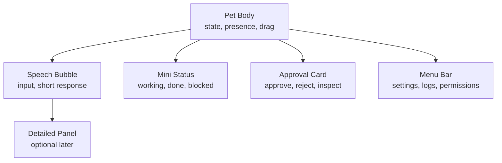
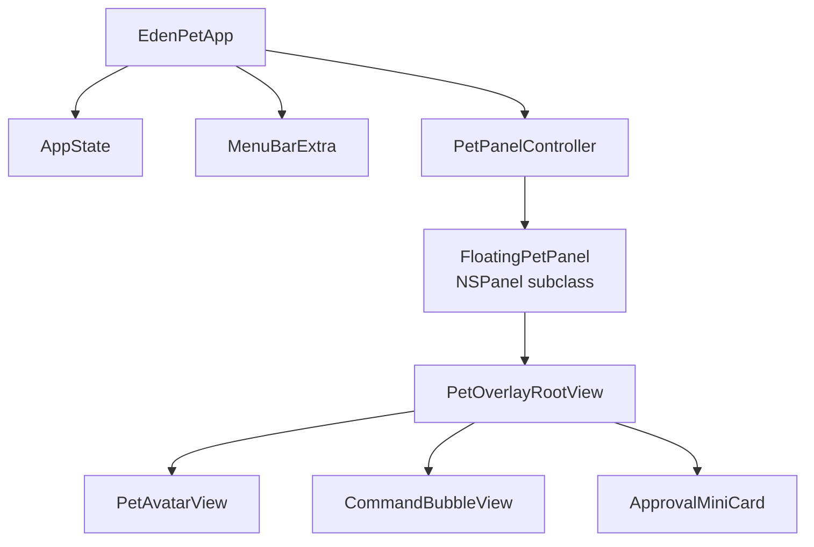
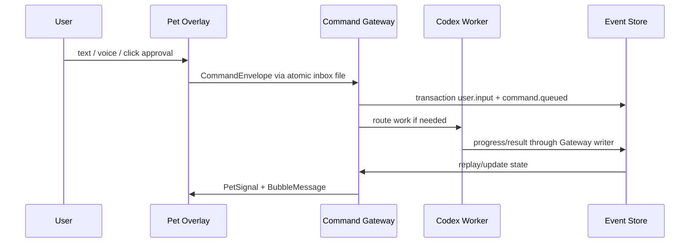
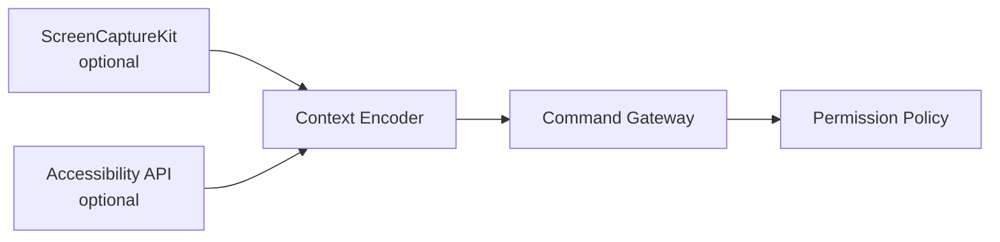

# Swift Native Codex Pet Blueprint

Date: 2026-05-05
Status: Product and technical blueprint
Decision: Replace dashboard-first front direction with a Swift-native always-on-top Pet overlay as the primary HCI surface.

## 0. Decision

The primary front should become a native macOS Pet overlay.

This does not remove the Eden/Jarvis architecture. It changes the first user-facing surface:

```txt
Before:
  web front / center Overlay Pet / bottom stream / right status panel

After:
  always-on-top Swift Pet overlay
  + expandable command bubble
  + compact approval/status surface
  + optional detailed panel later
```

The Pet is not the whole AI system. The Pet is the persistent HCI surface for command, state, approval, and presence.

The deeper system remains:

```txt
Codex App / Codex CLI       -> development and reasoning execution
Command Gateway            -> normalized control plane
Obsidian                   -> durable memory and ontology
Google/GitHub/Gmail/etc.   -> external action surfaces
Event Log                  -> replayable state truth
Pet Overlay                -> always-present state and input surface
```

## 1. Product Rationale

The user's goal is not a normal dashboard. The desired feeling is:

- Eden/Jarvis is always nearby.
- The AI has visible presence without occupying the whole screen.
- The user can command, approve, interrupt, and inspect work without switching context.
- The state is felt through animation first, then text only when needed.
- Deep work still happens inside Codex, local files, Obsidian, and connectors.

An always-on-top Pet fits this better than a large front because it behaves like a companion/control handle rather than another app to manage.

## 2. Scope Boundary

### In Scope

- Native macOS menu bar app.
- Transparent always-on-top Pet window.
- Drag, pin, hide, collapse, and summon behavior.
- Compact speech bubble for input and responses.
- Approval mini-card for risky actions.
- Status animation driven by `PetSignal`.
- File/event bridge to Command Gateway.
- Local permission and privacy surfaces.
- Later support for voice, screen context, and app automation.

### Out of Scope For The Pet

- Full dashboard replacement.
- Long logs as default surface.
- Obsidian editor replacement.
- Direct undocumented control of Codex App UI.
- Hidden autonomous execution without policy gates.
- Storing durable memory inside the Pet app.

## 3. Target UX

### Default State

The Pet sits above all windows in a small non-intrusive position. It should not steal focus during normal work.

Default behavior:

- idle animation when no task is active
- subtle state changes when background work is active
- no text unless the user clicks, speaks, or a task needs attention
- click opens a compact bubble
- global shortcut summons command input
- drag repositions
- long press or menu opens settings

### Interaction Zones



### Core Gestures

| Action | Result |
| --- | --- |
| click Pet | open compact command bubble |
| drag Pet | move overlay |
| double click | collapse/expand |
| right click | menu |
| global shortcut | focus command input |
| escape | hide active bubble |
| option-click | show current task details |

## 4. Visual Direction

The Pet should be expressive but operational.

Recommended visual style:

- one small original Overlay Pet form, not a dashboard mascot
- dark transparent material for bubbles
- very restrained text density
- state communicated by animation, glow, posture, and micro-expression
- no large modal overlay unless the user asks for detail

Single appearance rule:

```txt
The user sees one Pet.
Eden, Jarvis, and Hybrid do not get separate bodies, skins, colors, costumes, labels, or mascots.
Internal routing may change what the system does, but not who the Pet appears to be.
```

The Pet may vary activity, intensity, posture, glow strength, face expression, and motion rhythm. It must keep the same silhouette and identity across all routes.

The screenshot reference implies:

- compact body above the work surface
- bubble as temporary information surface
- dismiss and reply affordances
- friendly presence without blocking the entire screen

## 5. State Model

`PetSignal` is the canonical runtime-facing signal for the Overlay Pet.

```txt
PetSignal =
  route
  routeScores
  activity
  attention
  urgency
  confidence
  toolActivity
  memoryActivity
  voiceEnergy
  predictionError
  decisionPressure
  approvalPressure
  errorPressure
  progress
  sourceEventId
  derivedAt
  ttlSeconds
```

`PetSignal` is a derived runtime view. It is not the canonical system state.

Canonical direction:

```txt
EdenEvent Stream
-> ReservoirState
-> ReservoirToPetSignalAdapter
-> PetSignal
-> Swift animation state machine
```

The Pet must never write directly back into the reservoir.

### Internal Routes

Routes are internal routing state, not external appearance variants.

| Route | Meaning | User-Visible Treatment |
| --- | --- | --- |
| Eden | thinking, memory, daily life, reflection | same Pet, task wording may be reflective |
| Jarvis | development, execution, tools, files | same Pet, task wording may be execution-focused |
| Hybrid | strategy-to-execution bridge | same Pet, task wording may show synthesis |

Renderer rule:

- `route` and `routeScores` may influence routing metadata, task stream wording, and detail-panel context.
- `route` and `routeScores` must not select a different Pet body, route-specific color family, route badge, or visible mode label.
- The Overlay Pet visual state is primarily driven by `activity`, `attention`, `urgency`, `confidence`, `toolActivity`, `memoryActivity`, `voiceEnergy`, `predictionError`, `decisionPressure`, `approvalPressure`, and `errorPressure`.

### Activities

| Activity | Meaning | Pet Behavior |
| --- | --- | --- |
| idle | available | slow breath, small eye movement |
| listening | user input active | attentive posture, ear/halo pulse |
| responding | answer or typed output | mouth/text pulse, brighter face |
| thinking | reasoning or verification | slower scan, inward glow |
| working | tool or Codex task running | active body motion, progress accent |
| approval | waiting for user gate | held posture, pulsing outline |
| blocked | error, denial, or unsafe action | compressed posture, amber/red warning motion |
| done | task completed | short release animation |

The earlier 18-state Overlay Pet matrix is deprecated.

```txt
current model = one Pet appearance x runtime activity states
```

The Pet should support `listening` and `done` as runtime states even if early visual tests focus on idle/responding/thinking/working/approval/blocked.

## 6. Native macOS Architecture

Recommended stack:

```txt
SwiftUI              -> UI composition
AppKit NSPanel       -> floating non-activating overlay
MenuBarExtra         -> tray/menu entry
Combine/Observation  -> local state updates
Codable JSON         -> event bridge
FileCoordinator      -> safe file/event exchange where needed
SpriteKit/Rive/Metal -> Pet animation runtime
```

### Window Layer



`FloatingPetPanel` requirements:

- borderless
- transparent background
- non-activating where possible
- can join all spaces
- can appear over full-screen apps if allowed by macOS behavior
- hidden from Dock as much as practical through accessory/menu-bar app behavior
- click-through when idle if configured
- interactive only around Pet and active bubble

### WindowPolicy

The Pet must have an explicit macOS window policy before visual work starts.

```swift
struct WindowPolicy: Codable, Equatable {
    var level: WindowLevel
    var joinsAllSpaces: Bool
    var canAppearInFullScreen: Bool
    var activationMode: ActivationMode
    var idleHitTesting: HitTestingMode
    var activeHitTesting: HitTestingMode
    var emergencyHideShortcut: String
    var displayReattachMode: DisplayReattachMode
    var screenShareVisibility: ScreenShareVisibility
}
```

Baseline policy:

| Area | Decision |
| --- | --- |
| app activation | accessory/menu-bar app by default |
| panel type | borderless `NSPanel` controlled by `PetPanelController` |
| full screen | opt into all spaces/full-screen auxiliary behavior where macOS allows it |
| focus | Pet body must not activate the app unless command bubble/input is opened |
| click-through | idle transparent areas pass clicks to underlying apps |
| hit testing | only avatar, bubble, approval card, and menu affordances are interactive |
| multi-display | keep per-display placement; reattach to visible frame if monitor disappears |
| Stage Manager/Spaces | persist position per space where possible; otherwise use last visible display |
| global shortcut | must be user-configurable and conflict-detecting |
| emergency hide | one guaranteed shortcut hides all Pet windows immediately |
| screen share | user can hide Pet during screen sharing or recording |

Edge-case tests:

- active full-screen app
- multiple displays with one unplugged
- Stage Manager enabled
- app focus changes while bubble is open
- idle click-through over text editor, browser, and terminal
- emergency hide while approval card is visible
- global shortcut collision with another app

### Suggested Swift Types

```swift
struct PetSignal: Codable, Equatable {
    var route: PetRoute
    var routeScores: PetRouteScores
    var activity: PetActivity
    var attention: Double
    var urgency: Double
    var confidence: Double
    var toolActivity: Double
    var memoryActivity: Double
    var voiceEnergy: Double
    var predictionError: Double
    var decisionPressure: Double
    var approvalPressure: Double
    var errorPressure: Double
    var progress: Double?
    var sourceEventId: String
    var derivedAt: Date
    var ttlSeconds: Double
}

struct PetRouteScores: Codable, Equatable {
    var eden: Double
    var jarvis: Double
    var hybrid: Double
}

enum PetRoute: String, Codable {
    case eden
    case jarvis
    case hybrid
}

enum PetActivity: String, Codable {
    case idle
    case listening
    case responding
    case thinking
    case working
    case approval
    case blocked
    case done
}
```

### Reservoir To PetSignal Adapter

The adapter is a pure reducer. The same `ReservoirState` must always produce the same `PetSignal`.

Inputs:

```txt
ReservoirState
latestCommandStatus
pendingApprovalCount
latestErrorEvent
latestToolProgress
lastUserInputMode
```

Output rule:

```txt
PetSignal = clamp and map reservoir scores into one visual state.
No adapter may invent work that does not exist in the event log.
```

Route rule:

| Condition | Route |
| --- | --- |
| one route score exceeds the others by 0.15+ | that route |
| route scores are close and both personal/dev context are active | hybrid |
| command has explicit actorHint | actorHint, unless policy blocks it |
| no active command | previous route until `ttlSeconds`, then eden |

Visual identity rule:

The route result is metadata. It is not a skin selector.

Activity priority:

```txt
blocked      if errorPressure >= 0.70 or commandStatus == blocked
approval     if decisionPressure >= 0.60 or pendingApprovalCount > 0
working      if toolActivity >= 0.45 or commandStatus == running
responding   if voiceEnergy >= 0.25 or output stream is active
listening    if microphone or text input capture is active
thinking     if predictionError >= 0.35 or reasoning is active
done         if latest command succeeded within completion window
idle         otherwise
```

Stability rules:

- Use 300-700ms hysteresis before downgrading from `working`, `approval`, or `blocked`.
- Do not show `working` unless a command is `claimed` or `running`.
- Do not show `done` longer than 3-5 seconds unless the user opens details.
- If `derivedAt + ttlSeconds` is stale, the Pet must fall back to `idle` with a stale status hint.
- `progress` may be null when work has no measurable progress.
- The Pet silhouette, body material, face system, and base identity must remain identical across Eden, Jarvis, and Hybrid routing.

## 7. Animation Runtime Choice

Swift native does not mean every pixel must be hand-coded in SwiftUI.

Recommended default:

```txt
Pet character animation:
  Rive or SpriteKit state machine

Glow, particles, small effects:
  SpriteKit or Metal layer

Speech bubble and controls:
  SwiftUI
```

### Options

| Runtime | Best For | Risk |
| --- | --- | --- |
| Rive | stateful 2D character, expressions, transitions | external runtime dependency |
| SpriteKit | native particles, sprite atlas, lightweight game-like pet | asset authoring needed |
| Metal | premium custom glow, shader, performance | highest engineering cost |
| Lottie | pre-rendered vector loops | less interactive and less stateful |
| SwiftUI only | simplest prototype | visual quality likely too low |

Recommendation:

```txt
Phase 1 visual runtime: SpriteKit or Rive
Phase 2 premium effects: add Metal-backed glow layer only if needed
```

## 8. Command Gateway Bridge

The Pet should not directly control Codex threads.

It should write commands to the same baseline adapter already defined in the final blueprint:



### File-Event Worker Protocol

The file-event bridge is a transport boundary, not a free-for-all file writer.

Roles:

| Role | Owns | Must Not Do |
| --- | --- | --- |
| Pet | create command request files, read Pet updates | append event log directly |
| Gateway | validate commands, assign sequence, write event store, issue leases | execute tools without policy |
| Worker | claim leased work, execute adapter actions, report results to Gateway | mutate command state without lease |
| EventStore | canonical ordered events | accept direct writes from Pet or workers |

Command state machine:

```txt
received
-> queued
-> claimed
-> running
-> waiting-approval
-> running
-> succeeded / failed / cancelled / blocked
```

Atomic command submission:

```txt
1. Pet writes `eden-ops/inbox/commands/{commandId}.json.tmp`.
2. Pet fsyncs file where available.
3. Pet renames `.tmp` to `{commandId}.json`.
4. Gateway ingests only complete `.json` files.
5. Gateway validates schema and idempotency before queueing.
```

Worker ownership:

```txt
lease file:
  eden-ops/runtime/leases/{commandId}.lease.json

created with:
  exclusive create or Gateway transaction

contains:
  commandId
  workerId
  claimedAt
  expiresAt
  heartbeatAt
  actionHash
  scopeSnapshot
```

Lease rules:

- Only one active lease may exist per command.
- Worker must heartbeat before `expiresAt`.
- If heartbeat is stale, Gateway emits `worker.lease_expired` and requeues or fails according to retry policy.
- A worker result is accepted only if its lease is still valid.
- Duplicate `idempotencyKey` returns the existing command receipt instead of creating new work.
- External side effects are never retried silently after a stale lease.

Baseline EventStore:

```txt
canonical:
  eden-ops/audit/event-store.sqlite

optional export:
  eden-ops/audit/events.jsonl
  eden-ops/audit/tool-calls.jsonl
  eden-ops/audit/approvals.jsonl
```

SQLite WAL is the baseline because it gives transactional sequence assignment, idempotency checks, and crash recovery. JSONL remains an export/debug format, not the only canonical store.

### CommandEnvelope

```json
{
  "schemaVersion": "1.0",
  "id": "cmd_...",
  "idempotencyKey": "pet-session-hash-...",
  "createdAt": "2026-05-05T14:00:00Z",
  "source": "swift-pet",
  "sessionId": "session_...",
  "actorHint": "eden",
  "intentHint": "calendar.brief",
  "text": "이번 주 일정 알려줘",
  "attachments": [],
  "contextRefs": [],
  "requestedScope": {
    "workspaceId": null,
    "workspacePath": null,
    "vaultId": "primary-obsidian",
    "vaultPath": "/Users/isanginn/...",
    "threadId": null,
    "connectorIds": ["google-calendar"]
  },
  "userPresence": "active",
  "requestedMode": "auto",
  "riskHint": "unknown"
}
```

Compatibility rule:

`CommandEnvelope` must be a superset of `CommandGatewayPort.CommandInput`.

Required fields for policy and idempotency:

```txt
idempotencyKey
sessionId
text
requestedScope
userPresence
```

### PetUpdate

```json
{
  "schemaVersion": "1.0",
  "id": "pet_update_...",
  "correlationId": "cmd_...",
  "signal": {
    "route": "jarvis",
    "activity": "working",
    "attention": 0.7,
    "urgency": 0.2,
    "confidence": 0.8,
    "toolActivity": 0.9,
    "memoryActivity": 0.1,
    "voiceEnergy": 0.0,
    "approvalPressure": 0.0,
    "errorPressure": 0.0
  },
  "bubble": {
    "kind": "status",
    "text": "Codex 작업을 실행 중입니다.",
    "ttlSeconds": 6
  }
}
```

### Approval Resume Contract

Approvals must bind to the exact action being approved.

```json
{
  "approvalId": "approval_...",
  "commandId": "cmd_...",
  "resumeToken": "resume_...",
  "actionHash": "sha256:...",
  "scopeSnapshot": {
    "workspacePath": "/Users/isanginn/...",
    "vaultPath": "/Users/isanginn/...",
    "connectorIds": ["github"]
  },
  "previewRef": "eden-ops/previews/approval_....md",
  "reason": "GitHub push changes external repo state.",
  "requestedAt": "2026-05-05T14:00:00Z",
  "expiresAt": "2026-05-05T14:10:00Z"
}
```

Resume rules:

- Approving an action does not execute it immediately from the Pet.
- Pet sends `ApprovalDecision` to Gateway.
- Gateway verifies `resumeToken`, `actionHash`, `scopeSnapshot`, lease, and expiry.
- Gateway re-runs policy evaluation with the approval receipt attached.
- If anything changed, Gateway marks the approval stale and requests a new approval.
- Rejection, expiry, and stale approvals emit events and unblock the Pet UI with a clear reason.
- Approval cards must show enough preview context to avoid blind approval.

## 9. Permission And Safety Design

The Pet will eventually request sensitive macOS permissions. They must be progressive, not all at install time.

| Capability | macOS Permission | Request Timing |
| --- | --- | --- |
| microphone command | Microphone | first voice use |
| screen context | Screen Recording | first screen-aware request |
| click/type automation | Accessibility | first app-control request |
| cross-app automation | Automation / Apple Events | first app-specific control |
| files and Obsidian | file/folder access | vault setup |

Policy:

- The Pet must show why each permission is needed before triggering the system prompt.
- The Pet must work in text-only mode without screen or automation permission.
- Denied permissions should degrade capability, not break the Pet.
- Unattended external actions still require the existing permission policy matrix.

## 10. Autonomy Levels

The Pet may make the system feel autonomous, but safety must stay explicit.

| Level | Pet Behavior | Gate |
| --- | --- | --- |
| L0 observe | show state, read event log | no approval |
| L1 suggest | propose action or memory candidate | no approval |
| L2 safe local | run allowed read/build/test in trusted workspace | policy allow |
| L3 reversible edit | local edits in approved repo/worktree | policy plus preview where needed |
| L4 external change | calendar/mail/github/drive mutation | approval |
| L5 destructive/sensitive | delete, send, credentials, private memory promotion | explicit approval |

The Pet should make approvals quick, not remove them.

## 11. Data Storage

Recommended local app storage:

```txt
~/Library/Application Support/EdenPet/
  config.json
  window-state.json
  permissions.json
  cache/
  logs/

eden-ops/
  inbox/commands/
  outbox/results/
  audit/event-store.sqlite
  audit/events.jsonl
  audit/approvals.jsonl
  runtime/pet-state.json
  runtime/leases/
```

The Pet owns:

- UI preferences
- window position
- animation settings
- local cache

The Pet does not own:

- canonical memory
- long-term project truth
- Codex execution records
- Obsidian ontology definitions

## 12. Screen And App Awareness

Screen awareness should be treated as an optional sensor.



Rules:

- Do not continuously capture the screen by default.
- Use low-frequency snapshots or user-triggered capture first.
- Never store raw screenshots as memory without explicit user intent.
- Convert screen context into short evidence summaries when possible.
- Keep source trace if a decision used screen context.

### ScreenContextPolicy

Screen context is a sensor with privacy controls, not memory.

```txt
capture mode:
  off by default
  user-triggered snapshot first
  low-frequency contextual capture only after explicit enablement

excluded surfaces:
  password managers
  banking/payment sites
  private messaging windows
  system permission dialogs
  Pet overlay itself
  user-defined app/window denylist

retention:
  raw screenshot TTL: 0 seconds by default
  temporary processing cache: encrypted, short TTL, deleted after summary
  durable memory: summary only, never raw image unless user explicitly saves it
```

Redaction-before-event rule:

```txt
ScreenCaptureKit frame
-> local redaction / sensitive-window filter
-> short evidence summary
-> source trace
-> EdenEvent payloadRef
```

Required controls:

- user-visible capture indicator
- one-click pause screen sensing
- per-app denylist
- never capture secure text fields where detectable
- never include raw screenshot in Jarvis handoff
- do not screen-capture while approval cards show secrets or previews
- capture events must include app/window/source trace and retention policy

## 13. Codex Integration Boundary

The Pet can submit work to Codex-centered execution, but it should not rely on private UI automation of the Codex App as the baseline.

Baseline integration:

```txt
Pet -> Command Gateway -> file-event adapter -> Codex worker/thread
```

Future integration:

```txt
Pet -> Command Gateway -> native Codex adapter
Pet -> Command Gateway -> plugin adapter
Pet -> Command Gateway -> local model adapter
```

This preserves the design if Codex App capabilities change.

## 14. Failure Modes

| Failure | Cause | Mitigation |
| --- | --- | --- |
| cute but useless Pet | no command/event contract | implement Gateway bridge first |
| overlay blocks real work | bad click handling | click-through idle mode, quick hide shortcut |
| battery drain | constant animation/screen capture | idle FPS cap, reduced motion, capture on demand |
| privacy leak | raw screen/memory sent into dev context | HandoffEnvelope sanitizer |
| fake autonomy | animation says working but nothing is happening | PetSignal only from event state |
| app permission fatigue | asking for every permission upfront | progressive permission onboarding |
| Codex thread mismatch | direct UI assumptions | file-event baseline adapter |

## 15. Implementation Dependency Order

1. Define `PetSignal`, `CommandEnvelope`, `PetUpdate`, `WindowPolicy`, and `ScreenContextPolicy`.
2. Define `ReservoirState -> PetSignal` adapter tests.
3. Define EventStore single-writer and file-event worker lease protocol.
4. Define Approval Resume Contract.
5. Create Swift menu-bar app and transparent Pet panel.
6. Implement window positioning, drag, hide, emergency hide, and global shortcut conflict handling.
7. Implement static Pet idle/responding/working/approval/blocked states.
8. Connect Pet to local `eden-ops/runtime/pet-state.json`.
9. Connect command bubble to atomic `eden-ops/inbox/commands`.
10. Read Gateway-authored Pet updates and show bubble updates.
11. Add approval mini-card using resume-token approvals.
12. Add animation runtime state machine.
13. Add microphone input.
14. Add optional screen context behind `ScreenContextPolicy`.
15. Add optional app automation.
16. Add detailed panel only after the Pet is useful.

## 16. Acceptance Criteria

The Swift Pet direction is valid only if these pass:

- Pet can stay above normal desktop windows.
- Pet can be moved and hidden quickly.
- Pet does not steal focus during normal work.
- Pet can submit a command through the Gateway without direct Codex UI assumptions.
- Pet state can be replayed from event data.
- Approval-required work creates a visible mini-card.
- Approval resume fails closed if action hash, scope, lease, or expiry changes.
- Duplicate command idempotency does not execute work twice.
- A stale worker lease does not permit late results to mutate state.
- Idle animation uses low resources.
- The system still works when microphone, screen recording, and accessibility permissions are denied.
- WindowPolicy passes full-screen, Spaces, multi-display, click-through, and emergency-hide tests.
- ScreenContextPolicy prevents raw screen data from entering durable memory by default.

## 17. Final Verdict

Swift-native Pet overlay is the better primary front direction for the current Eden/Jarvis goal.

It optimizes for presence, fast control, and low context switching. It also avoids spending too much energy on a large dashboard before the command/control loop is proven.

The design is coherent if the following are treated as non-negotiable:

```txt
Pet is HCI surface, not AI brain.
Command Gateway is the control plane.
Event log is the truth.
Codex remains the deep execution host.
Obsidian remains durable memory.
Permissions are progressive and policy-gated.
```

## 18. Source Notes

- Apple NSPanel: https://developer.apple.com/documentation/appkit/nspanel
- Apple ScreenCaptureKit: https://developer.apple.com/documentation/screencapturekit
- Electron BrowserWindow reference, used only as contrast: https://www.electronjs.org/docs/api/browser-window
- Tauri window customization reference, used only as contrast: https://v2.tauri.app/learn/window-customization/
- OpenAI Codex help: https://help.openai.com/en/articles/11369540-codex-in-chatgpt
